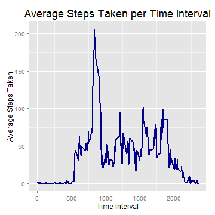

# Reproducible Research: Peer Assessment 1


## Loading and preprocessing the data

First I set the working directory to the cloned repo folder containing the zip file. Then I unzip and load the data file into R.

```r
setwd("C:/Users/midanekb14/RepData_PeerAssessment1")
unzip("./activity.zip")
actraw <- read.csv("./activity.csv")
```

Then I transform the date variable into a date object and the steps variable into a numeric object.

```r
actraw$date <- as.Date(actraw$date)  #transform date from factor to date object
actraw$steps <- as.numeric(actraw$steps)  #transform steps to numeric
```


## What is mean total number of steps taken per day?

First, I use the ddply() function in the plyr package to create a dataframe with the total number of steps taken each day.

```r
library(plyr)
stepsbydate <- ddply(actraw, .(date), summarize, totalsteps=sum(steps))
```

Then I use ggplot to create a histogram of the total number of steps taken each day. I added a vertical line indicating the mean of total steps per day (ignoring NAs).

```r
library(ggplot2)
ggplot(stepsbydate, aes(x=totalsteps)) + 
      geom_bar(binwidth=2000) + 
      geom_vline(aes(xintercept = mean(stepsbydate$totalsteps, na.rm=T)), 
                 linetype = "dashed", color = "darkblue", size = 1.1) +
      annotate("text", x=15000, y=15, color="darkblue", hjust=0,
               label=paste("Mean:", round(mean(stepsbydate$totalsteps, na.rm=T))),1) + 
      labs(title="Total Steps per Day", x="Total Steps", y="Count") +
      theme(plot.title = element_text(size=20, vjust=1)) +
      xlim(0, max(stepsbydate$totalsteps))
```

 

I also calculated the **mean** and **median** number of steps taken per day, again ignoring NAs. The mean (10,766) and median (10,765) are extremely close to one another, suggesting that the data is close to symmetrical.

```r
mean(stepsbydate$totalsteps, na.rm=T)
```

```
## [1] 10766
```

```r
median(stepsbydate$totalsteps, na.rm=T)
```

```
## [1] 10765
```


## What is the average daily activity pattern?

First, I use ddply() to create a dataframe with the mean number of steps taken during each 5-minute interval accross all days (ignoring NAs).

```r
library(plyr)
stepsbytime <- ddply(actraw, .(interval), summarize, mean=mean(steps, na.rm=T))
```

Then, I use ggplot to create a time series plot showing the average number of steps taken (y-axis) in each 5-minute interval (x-axis) across all days.

```r
library(ggplot2)
ggplot(stepsbytime, aes(x=interval, y=mean)) + 
      geom_line(size=1, color="darkblue") +
      labs(title="Average Steps Taken per Time Interval", 
           x="Time Interval", y="Average Steps Taken") +
      theme(plot.title = element_text(size=18, vjust=1))
```

 

The time interval with the highest average number of steps taken was interval 835, during which an average of 206.2 steps were taken. I believe this corresponds to 8:35-8:40am.

```r
# find time interval with highest average number of steps taken
stepsbytime[stepsbytime$mean == max(stepsbytime$mean),]
```

```
##     interval  mean
## 104      835 206.2
```


## Imputing missing values

First, I calculate the total number of missing values in the dataset. There are 2304 missing values.

```r
sum(is.na(actraw$steps)) #sum of NAs
```

```
## [1] 2304
```

Then, I replace all missing values with the average number of steps taken in the given interval across all days. I created a new dataframe containing the total steps with NAs and total steps with imputed NAs.

```r
act.imputed <- actraw
act.imputed$timeavg <- tapply(act.imputed$steps, act.imputed$interval, mean, na.rm=T)
act.imputed <- transform(act.imputed, corr.steps=ifelse(is.na(steps), timeavg, steps)) #replace NAs by avg steps for that interval
```

I use ddply() to create a new dataframe with the total number of steps taken each day with NAs and with imputed NAs.

```r
library(plyr)
stepsbydate.imputed <- ddply(act.imputed, .(date), summarize, totalsteps=sum(steps), totalsteps.imputed=sum(corr.steps))
```

I calculated the **mean** and **median** number of steps taken per day with NAs included and with imputed NAs. When you simply ignore NAs, the mean is 10,766 and the median is 10,765. when you replace NAs with the average number of steps for that time interval, the mean is the exact same (10,766) and the median is also 10,766. This is because all of the missing values come from just a few days and all of the values for these days are NAs. As a result, replacing NAs with the interval mean is the equivalent of replacing the total steps for these days with the mean number of a daily steps; since this is the only change being made to the data, it makes sense that the mean wouldn't change.

```r
t(data.frame(Mean = apply(stepsbydate.imputed[,2:3], 2, mean, na.rm=T),
      Median = apply(stepsbydate.imputed[,2:3], 2, median, na.rm=T),
      row.names = c("Total Steps (ignoring NAs)", "Total Steps (imputed NAs)")))
```

```
##        Total Steps (ignoring NAs) Total Steps (imputed NAs)
## Mean                        10766                     10766
## Median                      10765                     10766
```

Then I use ggplot to create a histogram of the total number of steps taken each day (with imputed NAs). I added a vertical line indicating the mean. This histogram is identical to the one created above except that the bar for the bin containing the mean number of daily steps is taller. As discussed above, this is because the only effect of imputing NAs was to replace the days that had missing values with exactly average days.

```r
library(ggplot2)

ggplot(stepsbydate.imputed, aes(x=totalsteps.imputed)) + 
      geom_bar(binwidth=2000) + 
      geom_vline(aes(xintercept = mean(stepsbydate.imputed$totalsteps.imputed, na.rm=T)), 
                 linetype = "dashed", color = "darkblue", size = 1.1) +
      annotate("text", x=15000, y=20, color="darkblue", hjust=0.5,
               label=paste("Mean:", 
                           round(mean(stepsbydate.imputed$totalsteps.imputed))),1) + 
      labs(title="Total Steps per Day
(NAs imputed to interval mean)", x="Total Steps", y="Count") +
      theme(plot.title = element_text(size=18, vjust=1)) +
      xlim(0, max(stepsbydate.imputed$totalsteps.imputed)*1.15)
```

 


## Are there differences in activity patterns between weekdays and weekends?

First, I create a new factor variable with the levels "Weekday" and "Weekend".

```r
act.imputed$weekday <- weekdays(act.imputed$date)
act.imputed$wkday.factor <- as.factor(ifelse(act.imputed$weekday %in% c("Saturday", "Sunday") == TRUE, "Weekend", "Weekday"))
```

Next, I use ddply to create a dataframe with the average number of steps taken (with imputed NAs) during each time interval for weekdays and weekend days.

```r
library(plyr)
stepsbywkday <- ddply(act.imputed, .(wkday.factor, interval), summarize, mean=mean(corr.steps))
```

I use gpplot to create a panel containing time series plots showing the average number of steps taken (y-axis) across all time intervals (x-axis) for weekdays and weekends. 

```r
library(ggplot2)
ggplot(stepsbywkday, aes(x=interval, y=mean, color=wkday.factor)) + 
      geom_line(size=1) + 
      theme_bw() + 
      facet_grid(.~wkday.factor) + 
      theme(legend.position="none") + 
      labs(title="Average Steps Taken per Time Interval
(Weekdays vs. Weekends)", x="Time Interval", y="Average Steps Taken") +
      theme(plot.title = element_text(size=18, vjust=1))
```

 

As you can see in the plot above, activity patterns differed for weekdays and weekend days.

- Waking up
      - On weekdays, this user became active early in the day, reaching 50 steps/interval just after 5am.
      - On weekends, this user became active later, not reaching 50 steps/interval until closer to 8am.
- Activity levels throughout day
      - On weekdays, this user had a large spike in activity around 8:35am, reaching nearly 250 steps/interval on average. Perhaps this user goes to the gym in the mornings before work or has a commute that involves a lot of walking. This morning spike was followed by a long period of low activity, during which average steps/interval did not exceed 100 until evening time. This may correspond to the user's workday, during which he or she is fairly sedentary (probably a desk job).
      - On weekends, there is no morning spike in activity, suggesting perhaps the users takes a break from the gym on weekends or doesn't have a commute on the weekend. On the other hand, the user is much more active throughout the day, exceeding 100 steps/interval many times during the morning and afternoon.
